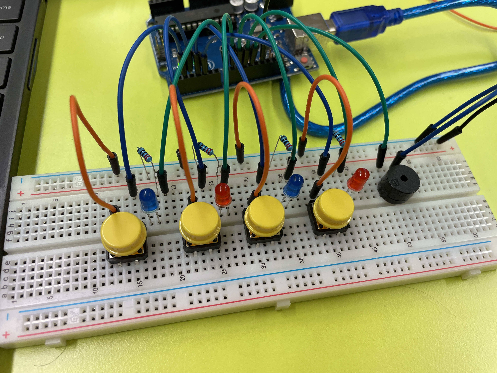
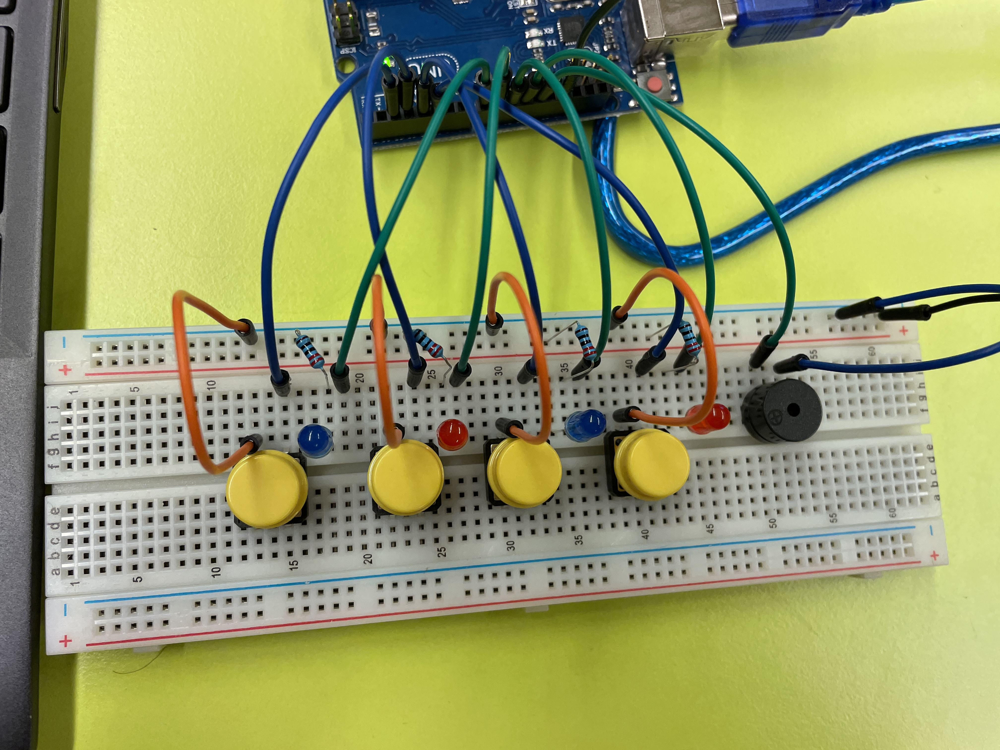
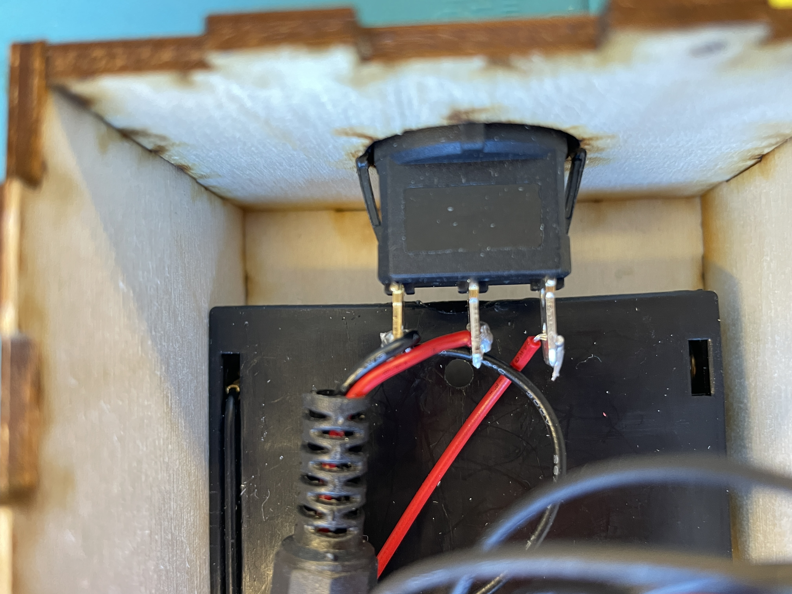
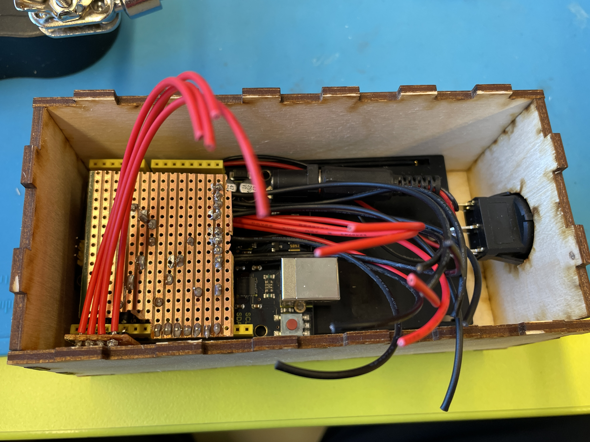
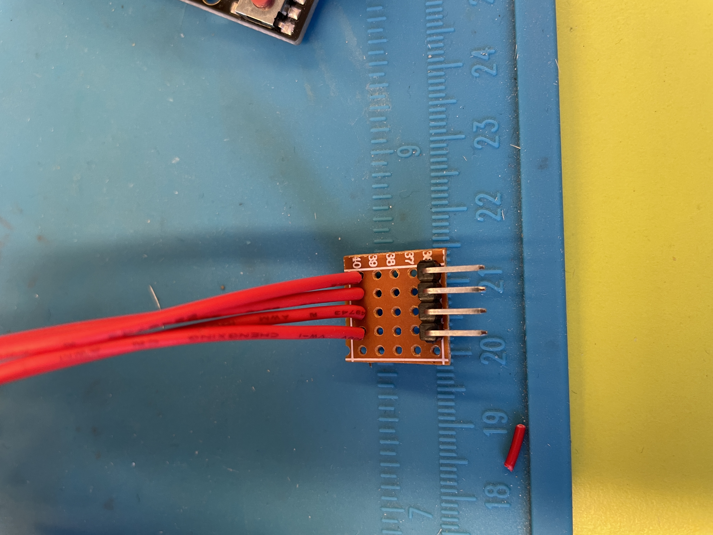
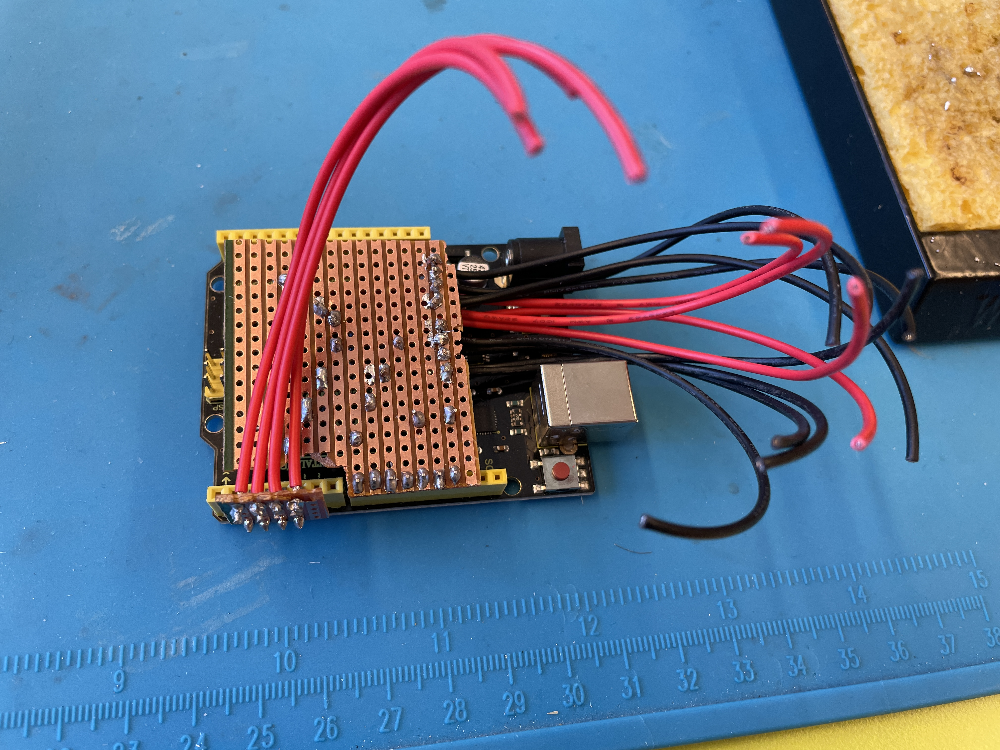
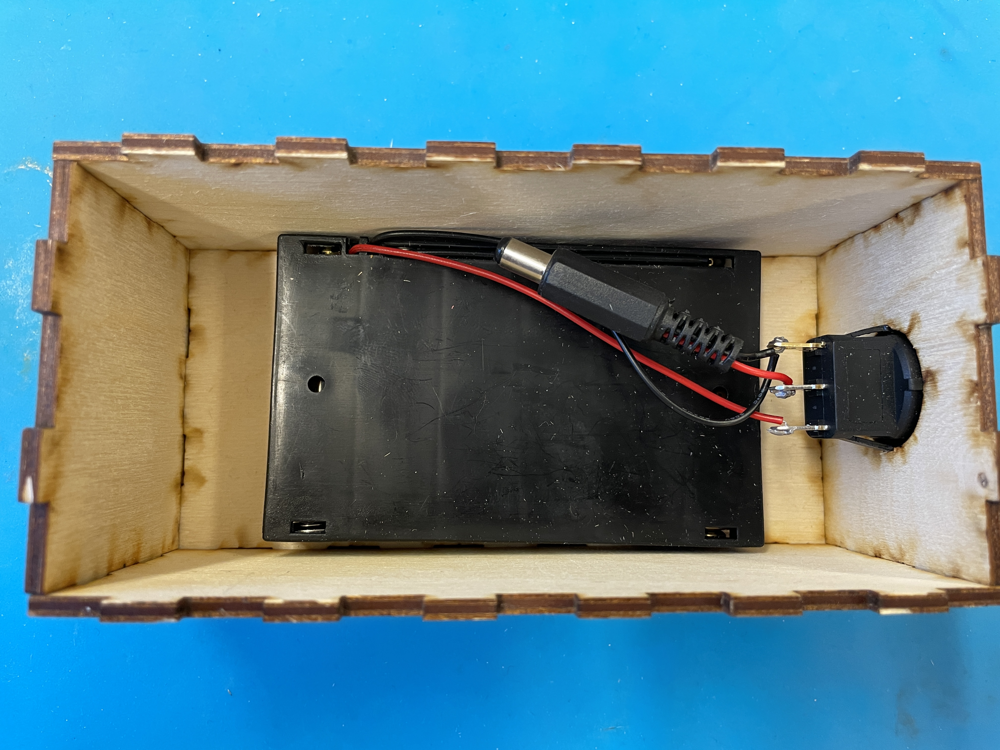
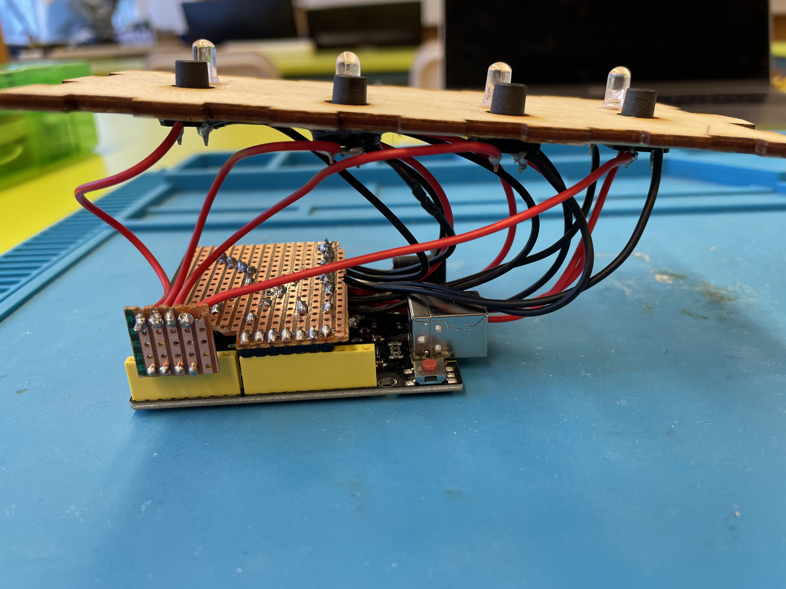
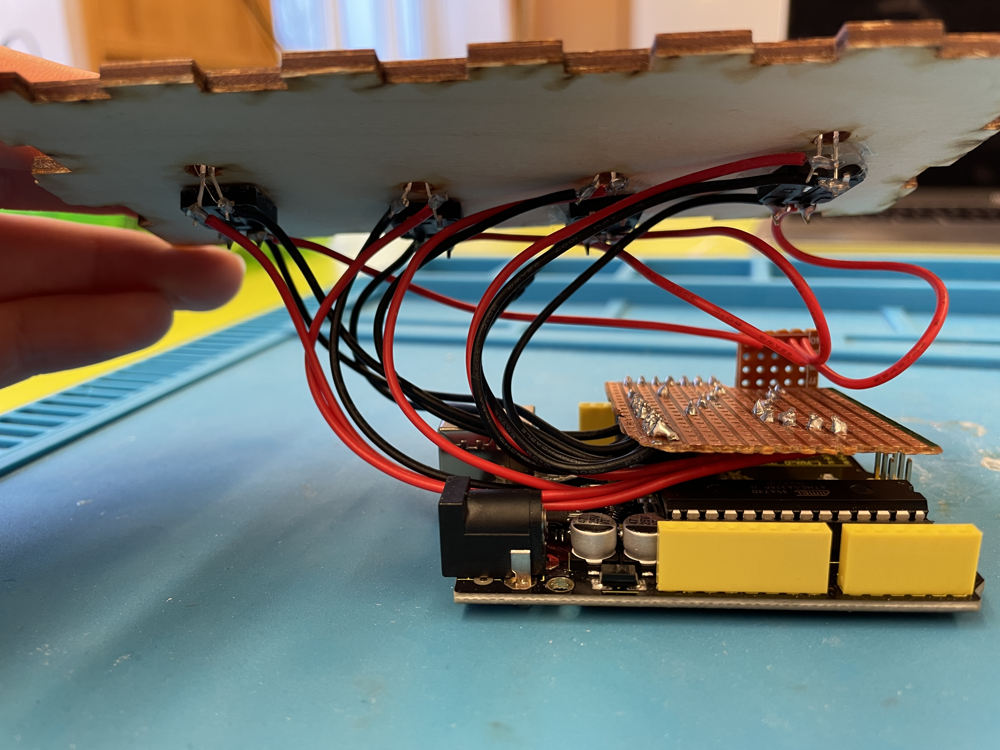
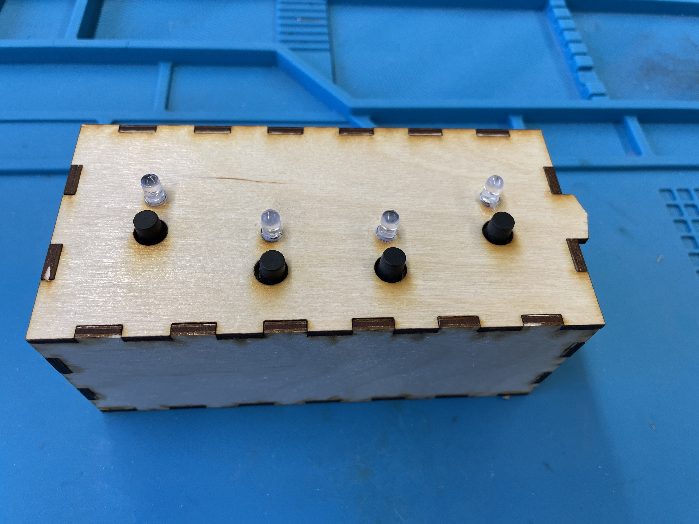

# Verkefni 5 - Simon Says

## Lýsing
##### Í þessu verkefni var smíðað spilið Simon Says frá grunni.
Það var byrjað á að búa til frumgerð af spilinu á brauðbretti með hlutum úr Arduino settinu.

## Frumgerð á brauðbretti

---

## Myndir af lóðun

---

## Myndir af lokaafurð

---

## Myndband af virkni lokaafurð
[Youtube](https://youtu.be/iBr2S6zKVVc)
